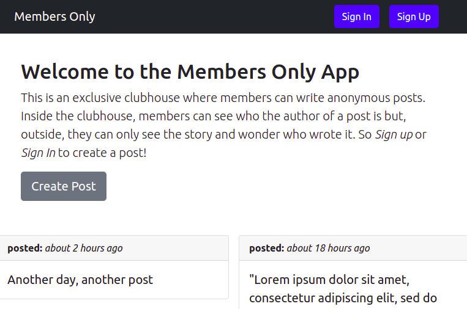
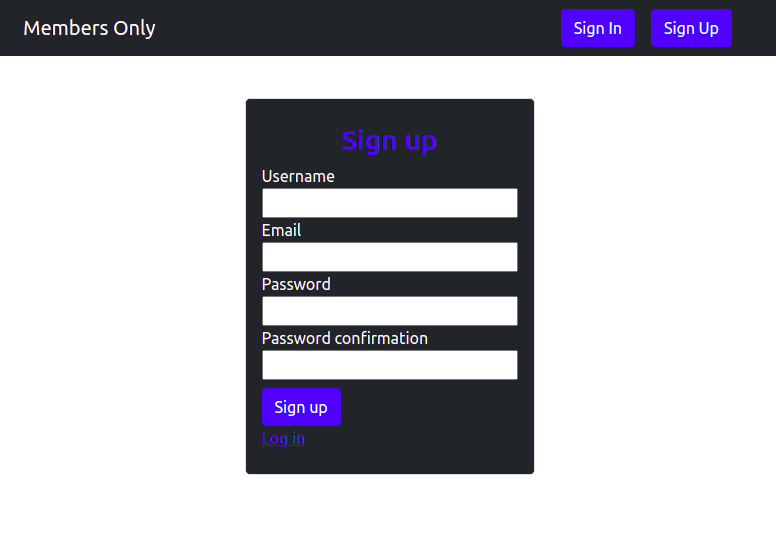

# MEMBERS ONLY _ AUTHENTICATION

In this project, an exclusive clubhouse where members can write anonymous posts is built. Inside the clubhouse, members can see who the author of a post is but, outside, they can only see the story and wonder who wrote it.

### Index View

### Sign Up View

## Built With

- Ruby on Rails
- Ruby ( version => 2.7.3 )
- Bootstrap 5.0

## Installation

### To get a local copy up and running follow these simple example steps.

1. To clone this repo run this code on a terminal window: 

   git clone git@github.com:John-Arboleda/members-only.git

2. install gems by this command

   bundle install

3. migrate the database by this command

   rails db:migrate

4. Open rails console in the terminal to start to add users, posts and comments by this command

   Rails console

## Authors

**John Arboleda**
- GitHub: [@John-Arboleda](https://github.com/John-Arboleda)
- Twitter: [@John_J_Arboleda](https://twitter.com/John_J_Arboleda)
- LinkedIn: [@john-arboleda](https://www.linkedin.com/in/john-arboleda/)

## 🤝 Contributing

Contributions, issues, and feature requests are welcome!

Feel free to check the [issues page]( https://github.com/John-Arboleda/members-only/issues).

## Show your support

Give a ⭐️ if you like this project!

## Acknowledgments
[THE ODIN PROJECT](https://www.theodinproject.com/paths/full-stack-ruby-on-rails/courses/ruby-on-rails/lessons/authentication)

## 📝 License

This project is [MIT](./LICENSE) licensed.